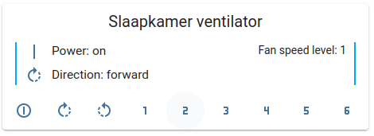

# CREATE IKOHS Windcalm DC ceiling fan
Create (IKOHS) Windcalm DC convert white ceiling fan (with remote and wireless)

After installing the ceiling fan, which was fairly easy I performed the wireless configuration and soon found the wireless implementation is based on Tuya.

The fan is well balanced, very stable, and doesn't make any sound apart from the wind it moves.
This fan is fitted with a LED panel, brightness can be adjusted, and allows three color modes (warm, warm-white, and white).
The remote control operates wireless (I have not gathered any specs).
Wireless only supports 2.4GHz.

# Major disappointment: state not updated
The state does not match/ is not updated when remote, and app (wireless) are both used. For example, if you turn on the fan using the CREATE app (or any Tuya compatible app) and you turn off the fan using the remote control the state is not updated, and the app still asumes the fan is turned on. The broadcasted messages (with state information) by the fan confirms this.

Most equipment around the house is operated and automated using Home-Assistant. The fan not reporting the correct state if the remote control is also used is not workable. 

# Disappointment: Light too bright and warm light could be warmer
We have installed the fan in the master bedroom, and the minimum brightness level is too bright. The warm color mode is not warm enough which I expected the color temperature to be around 2400K. If I guess the warm color temperature is around 3500K and white 6000K (Kelvin).

# Too bad: the beep cannot be disabled
Every action is acknowlegded with a short, soft beep which is annoying and cannot be disabled via software.

## Official answer from CREATE support

I shared this page with CREATE support and below the answer (sorry the answer in Dutch).
```
​Goedemiddag,

Dank u voor uw bericht.
Wij betreuren het dat het geluidssignaal dat bij elke actie wordt afgespeeld niet kan worden gedempt, het klinkt zoals standaard.
Wat betreft de App status die geen actie van de afstandsbediening laat zien, onze excuses als dit ongemak veroorzaakt, maar dit is normaal en duidt niet op een anomalie in het product. Houd er rekening mee dat elke actie die via de app wordt uitgevoerd, de opdracht correct aan het product zal geven, zelfs als de vorige actie die via de afstandsbediening of de TUYA SMART app werd uitgevoerd, niet op de app werd weergegeven.
Als er nog iets is waarmee we u kunnen helpen, aarzel dan niet om contact met ons op te nemen.
Met vriendelijke groet.
 
Julian B.
Customer Satisfaction 
CREATE
```

I think this concludes I will need to design my own custom PCB for the fan, and light.
If time allows let me check if I can find other enthousiasts that reverse enginered the remote or check myself how the remote works (like the frequencies, rolling codes, protocol, etc.).
Check the requirements of the motor controller and LED driver.

## Removing the buzzer from the control unit 
It is possible to remove the physical buzzer from the control unit, **permanently** disabling the beep (at your own risk!). To remove the buzzer, grab it with some pliers and gently pull it straight off.


# Annoying: the color temperature does not reflect/ cannot be set correctly

I upgraded Home-Assistant to 2021.7.2 and while tweaking the LocalTuya custom_component, and a custom card I found some other bugs. 
If you toggle the ceiling built-in lamp off and on (also using the app that is supplied from the vendor) it cycles through the different color temperatures: warm-light, warm-white-light, white-light.

The DPS control value with ID 23 keeps the same value, only updating the color temperature from the app seems to affect the color temperature. But after testing this more also this does not seems to be valid/ work.

I will raise a bug report regarding the color temperature issue, keep you updated.

I shared the video below:

[](https://www.youtube.com/watch?v=RsUFU2g8UfI)

And I received the official answer:
```
Hello,
We are contacting you in regards to the incident case opened form your side.
Please not that the modifications done from the remote or switch do not directly reflect in the APP.
It is also normal that the different brightnesses cycle while turning on/off the fan.
If you have further doubts we will be happy to help.
Kind regards,
Sarah L.
Customer Satisfaction
CREATE
```

Small code snippet, to show the color temperature does not work as expected.
```python
import tinytuya
import time

# DPS: {'20': False, '23': 0, '60': False, '62': 1, '63': 'forward', '64': 0}
# 20 used for the light if 'False' the light is off and if 'True' the light is on
# 22 used for the light brightness, value between 0 and 1000
# 23 used for the light color temperature if 1000 the light is warm, if 500 the light is Warm-White and if 0 the light is White
# 60 used for the fan if 'False' the fan is off and if 'True' the fan is on
# 62 used for speed control, value between 1 and 6
# 63 used for fan rotation direction, values are forward or reverse
# 64 is unknown

d = tinytuya.Device('DEVICE_ID_HERE', 'IP_ADDRESS_HERE', 'LOCAL_KEY_HERE')
d.set_version(3.3)

print(d.status())

print('first turn the lamp off')
d.set_value('20', False)
print(d.status())
time.sleep(2)

print('turn the lamp on')
d.set_value('20', True)
print(d.status())
time.sleep(2)

print('set the lamp color temperature to white')
# the lamp will turn off and on, but with the next color temperature 
# if the color temperature was 1000 (warm)       it will change to    0 (white)
# if the color temperature was    0 (warm)       it will change to  500 (warm-white)
# if the color temperature was  500 (warm-white) it will change to 1000 (warm)
# but the value of key 23 will stay 1000 (warm)
d.set_value('23', 0)
print(d.status())
time.sleep(2)

print('set the lamp color temperature to warm-white')
# the lamp will turn off and on, but with the next color temperature 
d.set_value('23', 500)
print(d.status())
time.sleep(2)

print('set the lamp color temperature to warm')
# the lamp will turn off and on, but with the next color temperature 
d.set_value('23', 1000)
print(d.status())
time.sleep(2)

print('set the lamp color temperature to warm-white')
# the lamp will turn off and on, but with the next color temperature 
d.set_value('23', 500)
print(d.status())
time.sleep(2)

print('set the lamp color temperature to warm')
# this updates the state key 23 with value 1000 and turns the lamp on,
# but the lamp decides to select a random color between [0 (white), 500 (warm-white), 1000 (warm)] 
# if the previous value was not 1000 (warm-white) it turns warm-white.
d.set_value('23', 1000)
print(d.status())
time.sleep(2)

print('set the lamp color temperature again to warm')
# the lamp will turn off and on, but with the next color temperature 
d.set_value('23', 1000)
print(d.status())
time.sleep(2)

print('set the lamp color temperature once more to warm')
# the lamp will turn off and on, but with the next color temperature 
d.set_value('23', 1000)
time.sleep(2)

print('now lets turn off the lamp, and turn it on again')
# the lamp will turn on but with the next color temperature
d.set_value('20', False)
time.sleep(2)
d.set_value('20', True)
time.sleep(2)

print('now lets turn off the lamp, and turn it on again')
d.set_value('20', False)
time.sleep(2)
d.set_value('20', True)
time.sleep(2)

print('now lets turn off the lamp, and turn it on again')
d.set_value('20', False)
time.sleep(2)
d.set_value('20', True)
time.sleep(2)

print('turn the lamp off')
# lamp turns off, nothing special
d.set_value('20', False)
time.sleep(2)

print('turn the lamp off again')
# lamp stays off, device beeps, nothing happens
d.set_value('20', False)
time.sleep(2)
```

# limitation: only 2 or 3 concurrent connections/ sessions seem possible
Another finding the device current connection handling is limited to it seems 3 concurrent connections/ sessions.
I also found that sending multiple updates in one payload or asynchronous to the fan is not supported.
The only option is to send events sequential (one-by-one).

If you have more details on this topic, feel free to share in the discussions.

# Home-Assistant localtuya and custom card



On the home-assistant side, I tweaked the fan integration of localtuya and created a custom card, updates will follow soon.

# Static IP address and drop Internet connectivity

I drop all Internet connectivity for the ceiling fan. To ensure the device firmware is not updated (I like to be in control and manage this myself), and it disables all operations via public Internet using the Tuya cloud. I use Home-Assistant for this. 

Actions on your local network can still be done in the same subnet. 

This goes beyond the scope of the ceiling fan, but I own router and access points from Mikrotik, and the specific configuration to implement this is/ could be:
Note: I manually changed the second half of the MAC address, this is not some kind of wildcard ;-)

```
# assign static DHCP address, not required for dropping Internet connectivity
/ip dhcp-server lease
add address=10.10.120.207 mac-address=10:D5:61:xx:xx:xx server=server120

# drop all connectivity
/ip firewall filter
add action=drop chain=forward comment="block Internet connectivity for the CREATE IKOHS (Tuya) ceiling fan" src-mac-address=10:D5:61:xx:xx:xx
```

Every router brand has it's own way of configuring DHCP and Firewall rules.
Be careful and protect your network if you leave Internet access enabled.

# Overview of DPS

Sample broadcast message:
```python
DPS: {'20': False, '23': 0, '60': False, '62': 1, '63': 'forward', '64': 0}
```

Key value mappings:
 - key: 20 is used for the light if `False` the light is off and if `True` the light is on
 - key: 22 is used for the light brightness, value between `0` and `1000`
 - key: 23 is used for the light color temperature if `1000` the light is warm, if `500` the light is Warm-White and if `0` the light is White
 - key: 60 is used for the fan if `False` the fan is off and if `True` the fan is on
 - key: 62 is used for speed control, value between `1` and `6`
 - key: 63 is used for fan rotation direction, values are `forward` or `reverse`
 - key: 64 is unknown


Good places to start are:
https://pypi.org/project/tinytuya
https://github.com/rospogrigio/localtuya
